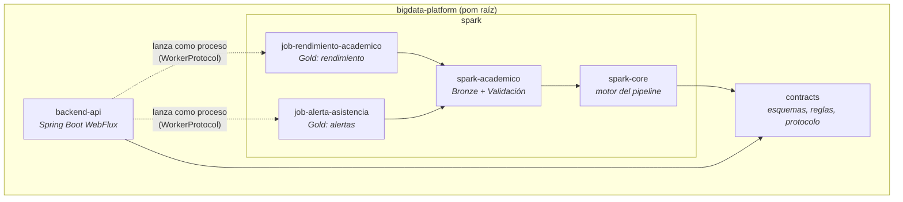
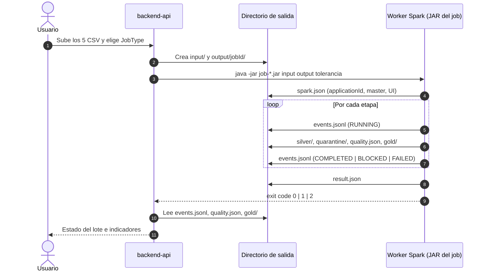
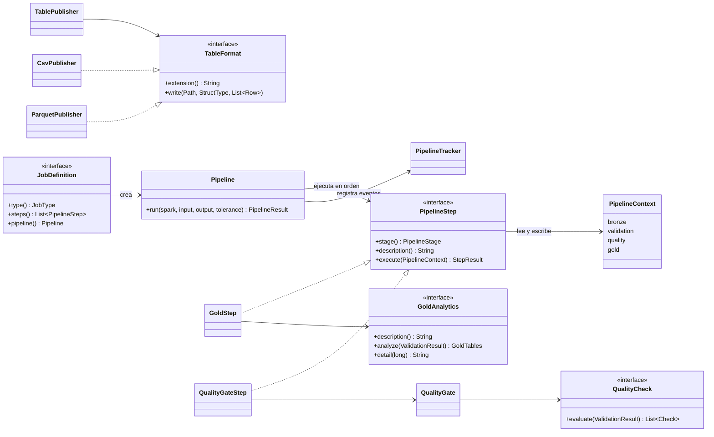
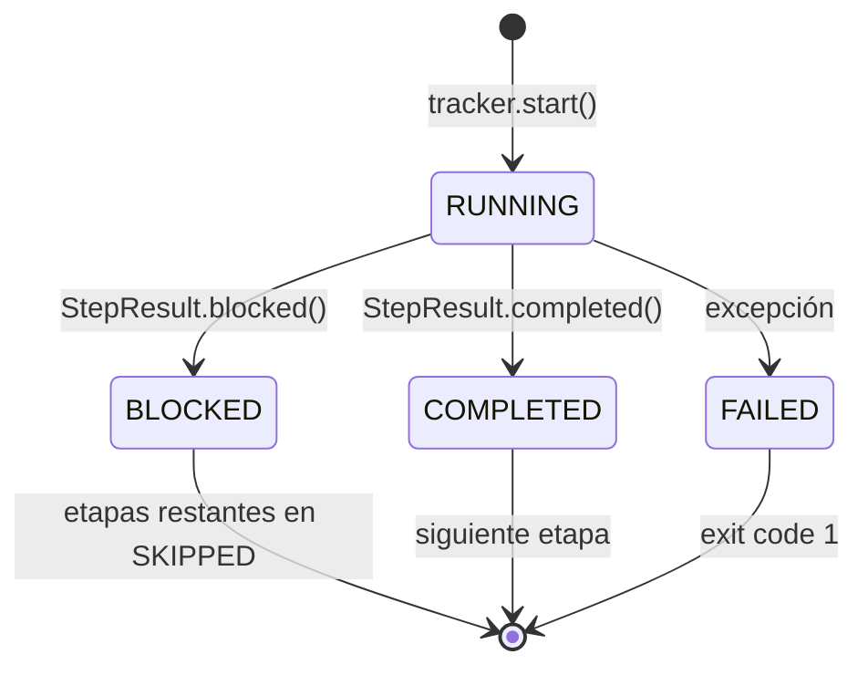
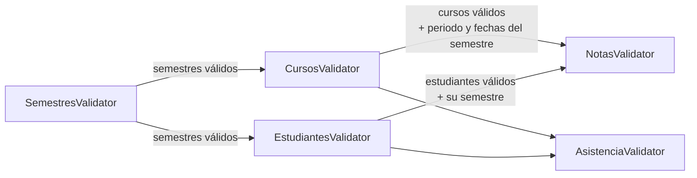
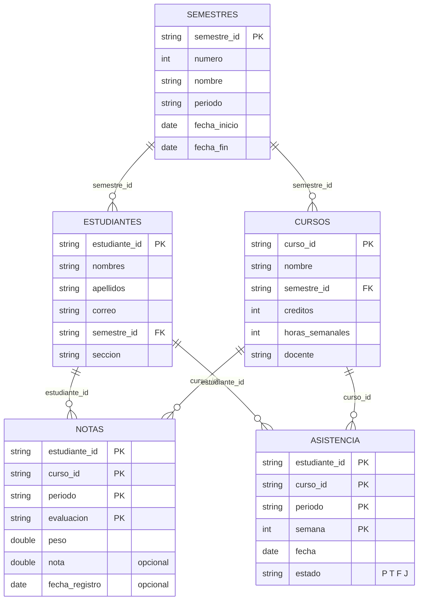

# Vallegrande Big Data Platform - Servicio Spark

Plataforma de procesamiento por lotes que toma los registros académicos de Vallegrande (semestres, cursos, estudiantes, notas y asistencia), los valida con reglas de calidad, separa las filas observadas en cuarentena y publica tablas analíticas listas para consumo: rendimiento académico, resúmenes por curso, sección y estudiante, distribución de notas y alertas de inasistencia.

El procesamiento se implementa con **Apache Spark 4.1** sobre una **arquitectura Medallion** (Bronze, Silver, Gold) con una **puerta de calidad** que decide si el lote puede publicarse.


<p align="center">
  
</p>

---

## Tabla de contenidos

1. [Visión general](#1-visión-general)
2. [Arquitectura](#2-arquitectura)
3. [Estructura del repositorio](#3-estructura-del-repositorio)
4. [Módulos](#4-módulos)
5. [Pipeline Medallion](#5-pipeline-medallion)
6. [Datos de entrada](#6-datos-de-entrada)
7. [Reglas de calidad](#7-reglas-de-calidad)
8. [Puerta de calidad](#8-puerta-de-calidad)
9. [Jobs y tablas Gold](#9-jobs-y-tablas-gold)
10. [Protocolo del worker](#10-protocolo-del-worker)
11. [Configuración](#11-configuración)
12. [Compilación y ejecución](#12-compilación-y-ejecución)
13. [Pruebas](#13-pruebas)
14. [Cómo extender el servicio](#14-cómo-extender-el-servicio)
15. [Decisiones de diseño](#15-decisiones-de-diseño)
16. [Archivos importantes](#16-archivos-importantes)
17. [Solución de problemas](#17-solución-de-problemas)
18. [Estado del proyecto](#18-estado-del-proyecto)
19. [Glosario](#19-glosario)

---

## 1. Visión general

### 1.1 Problema que resuelve

Los registros académicos llegan como archivos CSV exportados de un sistema de notas. Esos archivos pueden traer errores de digitación (notas fuera de escala, fechas inválidas, estados de asistencia desconocidos), registros duplicados o referencias rotas (un estudiante que no existe, un curso de otro semestre). Calcular indicadores directamente sobre esos datos produce reportes incorrectos.

El servicio Spark resuelve esto en un solo lote reproducible:

| Paso | Qué garantiza |
|------|---------------|
| Lectura controlada | Las 5 tablas se leen como texto con su número de fila original, sin perder ningún registro. |
| Validación | Cada fila se evalúa con 15 reglas agrupadas en 5 dimensiones de calidad. |
| Cuarentena | Las filas con problemas no se descartan: se guardan con su tabla, fila, clave, motivos y el registro original. |
| Silver | Las filas válidas se publican tipadas (enteros, decimales, fechas). |
| Puerta de calidad | Si alguna tabla supera la tolerancia de rechazo, el lote se bloquea y no se publica Gold. |
| Gold | Se calculan los indicadores del job (promedios, condición, asistencia, orden de mérito, alertas). |
| Exportación | Todas las tablas se publican en CSV y Parquet con escritura atómica, más un resumen JSON. |

### 1.2 Principios

- **Un pipeline, varios jobs.** Todas las etapas son compartidas; cada job solo aporta su analítica Gold.
- **Nada se pierde en silencio.** `recibidas = aceptadas + rechazadas` se verifica en cada ejecución.
- **Contratos explícitos.** Esquemas, reglas, políticas de calificación y protocolo de comunicación viven en un módulo `contracts` sin dependencias, compartido entre Spark y el backend.
- **Trazabilidad.** Cada etapa emite eventos en `events.jsonl` con duración, filas y número de jobs de Spark ejecutados.

---

## 2. Arquitectura

### 2.1 Vista de módulos



Las flechas sólidas son dependencias Maven. Las flechas punteadas representan la integración en tiempo de ejecución: el backend **no** depende de Spark, solo del módulo `contracts`.

### 2.2 Cómo está pensado el servicio

El servicio Spark se diseñó como un **worker por lotes desacoplado** del backend:

1. El backend recibe los CSV, los guarda en un directorio de entrada y crea un directorio de salida por ejecución (por convención, nombrado con el identificador del job).
2. El backend lanza el JAR del job como **proceso independiente** (`java -jar <modulo>.jar <input> <output> <tolerancia>`). Los nombres de módulo, JAR y clase principal salen del enum `JobType`.
3. El worker escribe su progreso en archivos dentro del directorio de salida (`events.jsonl`, `spark.json`, `quality.json`, `result.json`). El backend solo tiene que leer esos archivos para mostrar el avance.
4. Al terminar, el código de salida del proceso indica el resultado: `0` publicado, `1` error, `2` bloqueado por calidad.



> [!IMPORTANT]
> Este diseño de proceso separado aísla la JVM de Spark (memoria, `--add-opens`, dependencias de Hadoop) de la JVM del backend. Un fallo del job nunca tumba el API y cada ejecución deja un rastro completo en disco que puede auditarse después.

### 2.3 Flujo de punta a punta

El siguiente diagrama animado recorre un lote completo: desde que el usuario sube los archivos en el frontend hasta que recibe de vuelta los datos limpios y los indicadores. Se alternan dos ejecuciones para mostrar que el backend elige el job según el `JobType`: la **ejecución A** usa `RENDIMIENTO_ACADEMICO` y la **ejecución B** usa `ALERTA_ASISTENCIA`. Las etapas del pipeline son las mismas; solo cambia la analítica Gold y las tablas que se publican.

<p align="center">
  
</p>

| Paso | Carril | Qué ocurre | Elementos del código involucrados |
|------|--------|------------|-----------------------------------|
| 1 | Frontend | El usuario selecciona los 5 CSV (`semestres`, `cursos`, `estudiantes`, `notas`, `asistencia`), elige el tipo de análisis y la tolerancia de rechazo, y envía el lote al backend. | `JobType` (opciones disponibles y etiqueta legible con `label()`), `GradingPolicy.DEFAULT_MAX_REJECTED_RATIO` (0.05 como valor sugerido) |
| 2 | Backend API | Recibe los archivos y hace una validación previa barata, sin Spark: que estén las 5 tablas, que las cabeceras coincidan y que no se superen los límites de carga. Si algo falla, responde de inmediato sin lanzar ningún job. | `AcademicSchema.TABLES`, `COLUMNS`, `MAX_ROWS_PER_TABLE` (200 000), `MAX_BYTES_PER_TABLE` (20 MB), `MAX_CELLS_LENGTH` (200) |
| 3 | Backend API | Genera un identificador para el lote, guarda los CSV en un directorio de entrada y crea el directorio de salida `output/<jobId>/`. | Convención de nombres de `WorkerProtocol` |
| 4 | Backend API | Según el `JobType` elegido, lanza **un** proceso Java independiente con el JAR correspondiente y los argumentos `input output tolerancia`. La salida estándar del proceso se redirige a `worker.log`. | `JobType.jar()`, `JobType.mainClass()`, `WorkerProtocol.LOG_FILE` |
| 5 | Worker Spark | El job ejecuta las 7 etapas del pipeline Medallion. A medida que avanza escribe en disco: `events.jsonl` en cada etapa, `quarantine/` con las filas rechazadas, `silver/` con los datos limpios y tipados, `quality.json` con la decisión de la puerta de calidad, `gold/` con los indicadores (solo si el lote se publica) y por último `result.json`. Termina con el código de salida 0, 1 o 2. | `JobLauncher`, `AcademicSteps.medallion(...)`, `PipelineTracker`, `TablePublisher` |
| 6 | Backend API | Lee la carpeta de salida: `events.jsonl` mientras el job corre (progreso) y `result.json`, `quality.json` y el código de salida al terminar. Expone los archivos de `gold/`, `silver/` y `quarantine/` para consulta y descarga. | `WorkerProtocol` (`EVENTS_FILE`, `QUALITY_FILE`, `RESULT_FILE`, `SUMMARY_FILE`, `GOLD`, `SILVER`, `QUARANTINE`), `StageEvent`, `JobType.goldTables()` |
| 7 | Frontend | Muestra el progreso en vivo: qué etapa se está ejecutando y su estado (`RUNNING`, `COMPLETED`, `BLOCKED`, `SKIPPED`, `FAILED`). | `PipelineStage`, `StageStatus` |
| 8 | Frontend | Al terminar, presenta el resultado: indicadores de `gold/resumen.json`, tablas Gold, reporte de calidad y descarga de los datos limpios (`silver/`) y de los rechazados (`quarantine/`) para corregirlos. | `QualityRule` (descripción legible de cada motivo de rechazo) |

Cómo vuelve a salir la data limpia, según el resultado del lote:

| Resultado | Código de salida | Qué recibe el frontend |
|-----------|------------------|------------------------|
| Publicado | `0` | Tablas Gold del job y `resumen.json`, datos limpios de `silver/`, filas rechazadas de `quarantine/` y el reporte `quality.json`. |
| Bloqueado por calidad | `2` | Sin tablas Gold. Recibe `quality.json` con los chequeos que fallaron, `quarantine/rechazados` para corregir los datos y `silver/` para inspección. El usuario corrige y vuelve a enviar el lote. |
| Error | `1` | Mensaje de error desde `worker.log`; en `events.jsonl` la etapa que falló aparece como `FAILED`. |

> [!NOTE]
> El frontend y la lógica de orquestación del backend todavía no existen en este repositorio (ver [sección 18](#18-estado-del-proyecto)). Los pasos 1 a 4 y 6 a 8 describen el flujo **previsto**, construido sobre los contratos que ya están en `contracts`. El paso 5 está implementado y probado.

> [!TIP]
> El backend no necesita conocer Spark para seguir el progreso: basta con leer `events.jsonl` línea por línea. Cada línea es un `StageEvent` completo, por lo que puede reenviarse tal cual al frontend, por ejemplo mediante Server-Sent Events con WebFlux.

### 2.4 Stack tecnológico

| Componente | Versión | Uso |
|------------|---------|-----|
| Java | 17 | Lenguaje y runtime (`maven.compiler.release=17`) |
| Apache Spark SQL | 4.1.2 (Scala 2.13) | Motor de procesamiento distribuido |
| Apache Parquet | incluido en Spark | Escritura de archivos columnares |
| Jackson YAML | 2.21.2 | Lectura de `application.yaml` y escritura de JSON |
| Apache Commons CSV | 1.14.1 | Escritura de CSV de salida |
| JUnit Jupiter | 5.12.2 | Pruebas de integración de los jobs |
| Spring Boot | 3.5.16 | `backend-api` (WebFlux, Validation, Actuator) |
| Maven Wrapper | 3.9.16 | Construcción reproducible sin instalar Maven |

---

## 3. Estructura del repositorio

```text
00_IsaelFatama-Bigdata-Spark/
├── pom.xml                         # POM raíz: versiones, módulos y opciones JVM de Spark
├── mvnw / mvnw.cmd                 # Maven Wrapper
├── contracts/                      # Contratos compartidos (sin dependencias)
│   └── src/main/java/.../contracts/
│       ├── AcademicSchema.java     # Tablas, columnas, claves, columnas opcionales, límites
│       ├── GradingPolicy.java      # Nota aprobatoria, umbrales de inasistencia, condiciones
│       ├── JobType.java            # Catálogo de jobs: módulo, JAR, clase principal, tablas Gold
│       ├── PipelineStage.java      # BRONZE ... EXPORT
│       ├── QualityRule.java        # 15 reglas con dimensión y descripción
│       ├── StageEvent.java         # Evento de etapa escrito en events.jsonl
│       ├── StageStatus.java        # RUNNING, COMPLETED, BLOCKED, SKIPPED, FAILED
│       └── WorkerProtocol.java     # Exit codes y nombres de archivos/carpetas de salida
├── spark/
│   ├── pom.xml                     # Agregador Spark: dependencias, manifest y copia de lib/
│   ├── spark-core/                 # Motor genérico del pipeline
│   │   └── src/main/
│   │       ├── java/.../spark/core/
│   │       │   ├── config/         # SparkSessionFactory, WorkerConfig, PermissiveLocalFileSystem
│   │       │   ├── launcher/       # JobDefinition, JobLauncher (main común)
│   │       │   ├── layer/          # BronzeTables, ValidationResult, GoldTables
│   │       │   ├── pipeline/       # Pipeline, PipelineContext, PipelineStep, PipelineTracker...
│   │       │   ├── publication/    # TablePublisher, CsvPublisher, ParquetPublisher, JsonPublisher
│   │       │   ├── quality/        # QualityGate, QualityCheck, QualityReport
│   │       │   └── step/           # QuarantineStep, SilverStep, QualityGateStep, GoldStep, ExportStep
│   │       └── resources/
│   │           ├── application.yaml
│   │           └── log4j2.properties
│   ├── spark-academico/            # Dominio académico: extracción y validación
│   │   └── src/main/java/.../spark/academico/
│   │       ├── AcademicSteps.java  # Ensambla las 7 etapas para cualquier job académico
│   │       ├── extraction/         # CsvExtractor
│   │       ├── quality/            # MasterTablesCheck
│   │       ├── step/               # BronzeStep, ValidationStep
│   │       └── validation/         # Un validador por tabla + ValidationRules + ReferenceData
│   ├── job-rendimiento-academico/  # Job: rendimiento académico (7 tablas Gold)
│   └── job-alerta-asistencia/      # Job: alertas de inasistencia (2 tablas Gold)
├── backend-api/                    # API Spring Boot WebFlux (en construcción)
├── data/
│   ├── limpio/                     # Lote de referencia sin errores
│   └── con-errores/                # Mismo lote con errores inyectados
└── docs/assets/
    ├── pipeline-medallion.svg      # Diagrama animado del pipeline
    └── flujo-end-to-end.svg        # Diagrama animado frontend -> backend -> Spark -> resultados
```

---

## 4. Módulos

### 4.1 `contracts`

Módulo Java puro (sin dependencias) que define el **lenguaje común** entre el worker Spark y el backend. Cualquier cambio aquí afecta a ambos lados, por eso concentra todo lo que debe coincidir entre procesos.

| Clase | Responsabilidad |
|-------|-----------------|
| `AcademicSchema` | Nombres de las 5 tablas, orden de columnas, clave natural de cada tabla, columnas opcionales (`notas.nota`, `notas.fecha_registro`), estados de asistencia válidos (`P`, `T`, `F`, `J`), límites de carga y versión de reglas (`2.0.0`). |
| `GradingPolicy` | Escala 0 a 20, nota aprobatoria 13, inasistencia máxima 30 %, umbral de riesgo 20 %, tolerancia por defecto 5 % y las etiquetas de condición (`APROBADO`, `DESAPROBADO`, `INHABILITADO`, `PENDIENTE`, `EN_RIESGO`, `NORMAL`). |
| `JobType` | Catálogo de jobs disponibles. Cada entrada define módulo, JAR, clase `main`, etiqueta legible y lista de tablas Gold que produce. `JobType.DEFAULT = RENDIMIENTO_ACADEMICO`. |
| `PipelineStage` | Las 7 etapas en orden: `BRONZE`, `VALIDATION`, `QUARANTINE`, `SILVER`, `QUALITY_GATE`, `GOLD`, `EXPORT`. |
| `StageStatus` | Estados de una etapa: `RUNNING`, `COMPLETED`, `BLOCKED`, `SKIPPED`, `FAILED`. |
| `StageEvent` | Registro que se serializa como una línea de `events.jsonl`. |
| `QualityRule` | Las 15 reglas de calidad, cada una con su dimensión y descripción. |
| `WorkerProtocol` | Códigos de salida y nombres de archivos y carpetas que el worker produce. |

### 4.2 `spark/spark-core`

Motor **genérico** del pipeline. No conoce el dominio académico: solo sabe ejecutar una lista de etapas, registrar eventos, evaluar calidad y publicar tablas.

| Paquete | Clases clave | Qué hace |
|---------|--------------|----------|
| `config` | `WorkerConfig`, `SparkSessionFactory`, `PermissiveLocalFileSystem` | Lee `application.yaml`, crea la `SparkSession` con la configuración del worker, escribe `spark.json` y, en Windows sin Hadoop, reemplaza el sistema de archivos local para evitar `winutils.exe`. |
| `launcher` | `JobDefinition`, `JobLauncher` | `JobDefinition` es la interfaz que implementa cada job (`type()` y `steps()`). `JobLauncher` es el `main` común: valida argumentos, ejecuta el pipeline, escribe `result.json` y termina con el código de salida correcto. |
| `pipeline` | `Pipeline`, `PipelineStep`, `PipelineContext`, `PipelineTracker`, `StepResult`, `PipelineResult` | Orquesta las etapas en orden, comparte estado entre ellas mediante el contexto, detiene el pipeline si una etapa devuelve `blocked`, marca las restantes como `SKIPPED` y libera los `Dataset` cacheados al final. |
| `layer` | `BronzeTables`, `ValidationResult`, `GoldTables` | Representan el estado de cada capa. `ValidationResult` calcula conteos por tabla y por motivo de rechazo. |
| `quality` | `QualityGate`, `QualityCheck`, `QualityReport` | Evalúa la tolerancia por tabla, los chequeos adicionales y la conservación de filas, y produce el reporte `quality.json`. |
| `step` | `QuarantineStep`, `SilverStep`, `QualityGateStep`, `GoldStep`, `ExportStep`, `GoldAnalytics` | Etapas reutilizables. `GoldAnalytics` es el punto de extensión que cada job implementa. |
| `publication` | `TablePublisher`, `TableFormat`, `CsvPublisher`, `ParquetPublisher`, `JsonPublisher`, `AtomicFiles` | Escritura de tablas a CSV y Parquet y de documentos JSON, siempre mediante archivo temporal y movimiento atómico. |



### 4.3 `spark/spark-academico`

Capa de **dominio académico** compartida por todos los jobs. Implementa las etapas que dependen del esquema académico.

| Clase | Qué hace |
|-------|----------|
| `AcademicSteps.medallion(GoldAnalytics)` | Ensambla las 7 etapas en el orden correcto. Un job solo tiene que pasar su analítica Gold. |
| `AcademicSteps.qualityGate()` | Crea la puerta de calidad con la versión de reglas `2.0.0` y el chequeo `MasterTablesCheck`. |
| `extraction.CsvExtractor` | Lee las 5 tablas CSV con esquema de texto, recorta espacios, convierte vacíos en `null`, agrega la columna `fila` y cachea cada tabla. |
| `step.BronzeStep` | Etapa `BRONZE`: invoca al extractor y guarda `BronzeTables` en el contexto. |
| `step.ValidationStep` | Etapa `VALIDATION`: invoca a `AcademicValidator` y guarda `ValidationResult` en el contexto. |
| `validation.AcademicValidator` | Ejecuta los validadores en orden de dependencia y arma las tablas Silver y la tabla de rechazados. |
| `validation.*Validator` | Un validador por tabla (`Semestres`, `Cursos`, `Estudiantes`, `Notas`, `Asistencia`). Tipan columnas con `try_cast` y aplican las reglas propias de la tabla. |
| `validation.ValidationRules` | Reglas comunes: campo requerido, detección de duplicados, filtro de válidas y armado de la fila de cuarentena. |
| `validation.ReferenceData` | Tablas de referencia ya validadas (semestres, cursos, estudiantes) que se usan para las reglas de integridad y consistencia. |
| `quality.MasterTablesCheck` | Exige que `semestres`, `cursos` y `estudiantes` tengan al menos una fila válida. |

### 4.4 `spark/job-rendimiento-academico`

Job principal (`JobType.RENDIMIENTO_ACADEMICO`). Clase `main`: `pe.edu.vallegrande.bigdata.job.rendimiento.RendimientoAcademicoJob`. Su analítica (`AcademicAnalytics`) se compone de un constructor de tabla por cada salida (`PerformanceBuilder`, `CourseSummaryBuilder`, `StudentSummaryBuilder`, `SectionSummaryBuilder`, `AssessmentSummaryBuilder`, `GradeDistributionBuilder`, `WeeklyAttendanceBuilder`, `SummaryBuilder`). Detalle en la [sección 9.1](#91-job-rendimiento-academico).

### 4.5 `spark/job-alerta-asistencia`

Job de alertas tempranas (`JobType.ALERTA_ASISTENCIA`). Clase `main`: `pe.edu.vallegrande.bigdata.job.asistencia.AlertaAsistenciaJob`. Su analítica (`AttendanceAlertAnalytics`) clasifica cada matrícula según su porcentaje de faltas. Detalle en la [sección 9.2](#92-job-alerta-asistencia).

### 4.6 `backend-api`

Aplicación Spring Boot (WebFlux, Validation, Actuator) que depende únicamente de `contracts`. Será la responsable de recibir los archivos, lanzar los workers según `JobType` y exponer el estado y los resultados leyendo los archivos del `WorkerProtocol`.

> [!NOTE]
> A la fecha, `backend-api` contiene solo la clase de arranque `BigDataApplication`. La integración descrita en la [sección 2.2](#22-cómo-está-pensado-el-servicio) es el contrato de diseño que ya cumple el worker Spark.

---

## 5. Pipeline Medallion

### 5.1 Resumen de etapas

| # | Etapa | Clase | Módulo | Entrada | Salida | Puede bloquear |
|---|-------|-------|--------|---------|--------|----------------|
| 1 | `BRONZE` | `BronzeStep` | spark-academico | `<input>/*.csv` | `BronzeTables` en memoria (cacheadas) | No |
| 2 | `VALIDATION` | `ValidationStep` | spark-academico | `BronzeTables` | `ValidationResult` (válidas, rechazadas, conteos) | No |
| 3 | `QUARANTINE` | `QuarantineStep` | spark-core | Filas rechazadas | `quarantine/rechazados.{csv,parquet}` | No |
| 4 | `SILVER` | `SilverStep` | spark-core | Filas válidas tipadas | `silver/<tabla>.{csv,parquet}` | No |
| 5 | `QUALITY_GATE` | `QualityGateStep` | spark-core | `ValidationResult` + tolerancia | `quality.json` | **Sí** |
| 6 | `GOLD` | `GoldStep` | spark-core + job | Tablas Silver | `GoldTables` en memoria | No |
| 7 | `EXPORT` | `ExportStep` | spark-core | `GoldTables` | `gold/<tabla>.{csv,parquet}` y `gold/resumen.json` | No |

> [!IMPORTANT]
> Cuarentena y Silver se publican **antes** de la puerta de calidad. Aunque el lote quede bloqueado, siempre quedan disponibles los rechazados (para corregirlos) y las filas válidas (para inspección). Lo único que la puerta impide es publicar indicadores Gold sobre un lote de mala calidad.

### 5.2 Ciclo de vida de una etapa



Cada transición se escribe como una línea JSON en `events.jsonl`. Al iniciar una etapa, `PipelineTracker` abre un *job group* de Spark con el nombre de la etapa; al cerrarla cuenta cuántos jobs de Spark se ejecutaron dentro de ese grupo (`sparkJobs`). Esto permite relacionar cada etapa con lo que se ve en la Spark UI.

### 5.3 BRONZE: lectura de los CSV

Implementada por `CsvExtractor`:

1. Verifica que existan los 5 archivos: `semestres.csv`, `cursos.csv`, `estudiantes.csv`, `notas.csv`, `asistencia.csv`. Si falta uno, lanza `IllegalArgumentException` y el job termina con código `1`.
2. Lee cada archivo con un esquema explícito **todo en texto** (`StringType`), cabecera activa, codificación UTF-8 y modo `PERMISSIVE`.
3. Aplica `nullif(trim(columna), '')` a todas las columnas: los espacios sobrantes se eliminan y las celdas vacías pasan a `null`.
4. Agrega la columna `fila`, que corresponde al **número de línea en el archivo original** (la cabecera es la línea 1, el primer registro la línea 2).
5. Cachea la tabla y cuenta sus filas.

> [!TIP]
> Leer todo como texto es intencional: si Spark infiriera tipos, una nota como `"quince"` se convertiría en `null` sin dejar rastro. Al tipar después con `try_cast`, el pipeline puede distinguir "celda vacía" de "valor inválido" y reportar la regla exacta.

### 5.4 VALIDATION: reglas de calidad

Implementada por `AcademicValidator`. Los validadores se ejecutan en **orden de dependencia** porque las tablas de hechos se validan contra las tablas maestras ya depuradas:



Para cada tabla, el validador:

1. Convierte las columnas numéricas y de fecha con `try_cast` en columnas auxiliares (`_nota`, `_peso`, `_fecha`, etc.).
2. Une la tabla con las referencias necesarias (`ReferenceData`) mediante *left join*.
3. Evalúa todas las reglas a la vez y concatena las que fallan en la columna `motivos` separadas por `|`. Una fila es válida cuando `motivos` está vacío.
4. Marca duplicados: dentro de cada clave natural se conserva **la primera fila válida** (o la primera por número de fila si ninguna es válida); el resto recibe `REGISTRO_DUPLICADO`.
5. Publica sus filas válidas como referencia para los validadores siguientes.

> [!WARNING]
> Los rechazos se **propagan en cascada**. Si un estudiante se rechaza en `estudiantes.csv` (por ejemplo, por `SEMESTRE_INEXISTENTE`), todas sus notas y asistencias se rechazarán como `ESTUDIANTE_INEXISTENTE`. En el lote `data/con-errores`, un solo estudiante rechazado (`VG260088`) arrastra 180 filas de notas y asistencia, casi tres cuartas partes de los 245 rechazos. Corrige primero las tablas maestras.

### 5.5 QUARANTINE: filas observadas

`QuarantineStep` publica la tabla `quarantine/rechazados` con una fila por registro rechazado de cualquier tabla, ordenada por tabla y número de fila:

| Columna | Descripción | Ejemplo |
|---------|-------------|---------|
| `tabla` | Tabla de origen | `asistencia` |
| `fila` | Línea en el CSV original | `1528` |
| `clave` | Clave natural unida con ` · ` (`?` si falta un valor) | `VG260011 · EIA · 2026-II · 7` |
| `motivos` | Reglas incumplidas separadas por `\|` | `ESTADO_INVALIDO` |
| `registro` | Registro original completo en JSON (incluye nulos) | `{"estudiante_id":"VG260011",...,"estado":"X"}` |

### 5.6 SILVER: datos limpios y tipados

`SilverStep` publica una tabla por entidad con solo filas válidas y tipos definitivos:

| Tabla | Columnas y tipos |
|-------|------------------|
| `semestres` | `semestre_id` texto, `numero` int, `nombre` texto, `periodo` texto, `fecha_inicio` date, `fecha_fin` date |
| `cursos` | `curso_id` texto, `nombre` texto, `semestre_id` texto, `creditos` int, `horas_semanales` int, `docente` texto |
| `estudiantes` | `estudiante_id`, `nombres`, `apellidos`, `correo`, `semestre_id`, `seccion` (texto) |
| `notas` | `estudiante_id`, `curso_id`, `periodo`, `evaluacion` texto, `peso` double, `nota` double (nullable), `fecha_registro` date (nullable) |
| `asistencia` | `estudiante_id`, `curso_id`, `periodo` texto, `semana` int, `fecha` date, `estado` texto en mayúsculas |

### 5.7 QUALITY_GATE

Ver la [sección 8](#8-puerta-de-calidad). Si la decisión es negativa, la etapa termina en `BLOCKED`, `GOLD` y `EXPORT` se registran como `SKIPPED` y el proceso termina con código `2`.

### 5.8 GOLD

`GoldStep` delega en la implementación de `GoldAnalytics` del job. La analítica recibe el `ValidationResult` (acceso a las 5 tablas Silver) y devuelve un `GoldTables` con:

- `primary`: nombre de la tabla principal (su número de filas es `goldRows` en `result.json`).
- `tables`: mapa ordenado de tablas Gold a publicar.
- `summary`: un `Dataset` de una sola fila que se exporta como `gold/resumen.json`.

### 5.9 EXPORT

`ExportStep` publica cada tabla Gold en todos los formatos configurados (CSV y Parquet) y escribe `gold/resumen.json`. Reporta el número de archivos publicados (en el job de rendimiento: 7 tablas x 2 formatos + 1 resumen = 15 archivos).

---

## 6. Datos de entrada

### 6.1 Modelo



### 6.2 Formato de los archivos

| Tabla | Archivo | Clave natural | Columnas opcionales |
|-------|---------|---------------|---------------------|
| Semestres | `semestres.csv` | `semestre_id` | ninguna |
| Cursos | `cursos.csv` | `curso_id` | ninguna |
| Estudiantes | `estudiantes.csv` | `estudiante_id` | ninguna |
| Notas | `notas.csv` | `estudiante_id`, `curso_id`, `periodo`, `evaluacion` | `nota`, `fecha_registro` |
| Asistencia | `asistencia.csv` | `estudiante_id`, `curso_id`, `periodo`, `semana` | ninguna |

Requisitos de formato:

- Codificación UTF-8 con fila de cabecera.
- Fechas en formato ISO `AAAA-MM-DD`.
- Notas en escala 0 a 20; pesos en el intervalo (0, 1].
- Estados de asistencia: `P` presente, `T` tardanza, `F` falta, `J` justificada (se aceptan en minúsculas y se normalizan a mayúsculas).

> [!NOTE]
> Una nota vacía no es un error: representa una evaluación **programada pero aún no registrada**. Por eso `nota` y `fecha_registro` son opcionales y el job de rendimiento las cuenta como evaluaciones pendientes.

### 6.3 Lotes de ejemplo incluidos

| Lote | semestres | cursos | estudiantes | notas | asistencia | Total | Uso |
|------|-----------|--------|-------------|-------|------------|-------|-----|
| `data/limpio` | 6 | 9 | 120 | 4 320 | 17 280 | 21 735 | Caso feliz: 0 rechazos, 1 080 matrículas en Gold |
| `data/con-errores` | 6 | 9 | 123 | 4 331 | 17 290 | 21 759 | Errores inyectados: 245 rechazos |

---

## 7. Reglas de calidad

Versión de reglas: **2.0.0** (`AcademicSchema.RULES_VERSION`). Cada regla pertenece a una dimensión de calidad:

| Regla | Dimensión | Tablas | Condición de rechazo |
|-------|-----------|--------|----------------------|
| `CAMPO_REQUERIDO` | COMPLETITUD | todas | Falta un valor en una columna no opcional |
| `NOTA_NO_NUMERICA` | VALIDEZ | notas | `nota` presente pero no convertible a número |
| `NOTA_FUERA_DE_RANGO` | VALIDEZ | notas | `nota` fuera de 0 a 20 |
| `PESO_INVALIDO` | VALIDEZ | notas | `peso` no numérico, menor o igual a 0 o mayor a 1 |
| `ESTADO_INVALIDO` | VALIDEZ | asistencia | `estado` distinto de P, T, F o J |
| `FECHA_INVALIDA` | VALIDEZ | semestres, notas, asistencia | Fecha presente pero no válida en formato `AAAA-MM-DD` |
| `NUMERO_INVALIDO` | VALIDEZ | semestres, cursos, asistencia | `numero`, `creditos`, `horas_semanales` o `semana` no entero o no positivo |
| `CORREO_INVALIDO` | VALIDEZ | estudiantes | `correo` no cumple `^[^@\s]+@[^@\s]+\.[^@\s]+$` |
| `REGISTRO_DUPLICADO` | UNICIDAD | todas | La clave natural ya apareció en una fila anterior |
| `SEMESTRE_INEXISTENTE` | INTEGRIDAD | cursos, estudiantes | `semestre_id` no existe entre los semestres válidos |
| `ESTUDIANTE_INEXISTENTE` | INTEGRIDAD | notas, asistencia | `estudiante_id` no existe entre los estudiantes válidos |
| `CURSO_INEXISTENTE` | INTEGRIDAD | notas, asistencia | `curso_id` no existe entre los cursos válidos |
| `CURSO_DE_OTRO_SEMESTRE` | CONSISTENCIA | notas, asistencia | El curso no pertenece al semestre del estudiante |
| `PERIODO_INCONSISTENTE` | CONSISTENCIA | notas, asistencia | `periodo` distinto al periodo del semestre del curso |
| `FECHA_FUERA_DE_PERIODO` | CONSISTENCIA | asistencia | `fecha` anterior al inicio o posterior al fin del semestre del curso |

> [!NOTE]
> Una fila puede incumplir varias reglas a la vez (por ejemplo `CAMPO_REQUERIDO|ESTUDIANTE_INEXISTENTE`). La fila se cuenta **una vez** como rechazada, pero cada regla suma en su dimensión, por lo que la suma de `dimensions` en `quality.json` puede ser mayor que el número de filas rechazadas.

---

## 8. Puerta de calidad

`QualityGate` evalúa tres tipos de chequeos. El lote se publica solo si **todos** pasan:

| Chequeo | Origen | Pasa cuando |
|---------|--------|-------------|
| `Rechazo en <tabla>` (uno por tabla) | `QualityGate` | `rechazadas / recibidas <= tolerancia`. Una tabla vacía cuenta como 100 % de rechazo. |
| `Tabla maestra <tabla> con datos válidos` | `MasterTablesCheck` | `semestres`, `cursos` y `estudiantes` tienen al menos una fila válida. |
| `Conservación de filas` | `QualityGate` | `recibidas = aceptadas + rechazadas`. |

La **tolerancia** es el tercer argumento del job (`threshold`), un número entre `0` y `1`. El valor recomendado es `0.05` (`GradingPolicy.DEFAULT_MAX_REJECTED_RATIO`).

> [!IMPORTANT]
> La tolerancia se evalúa **por tabla**, no sobre el total del lote. En `data/con-errores` el rechazo global es 1,13 %, pero `estudiantes` tiene 3,25 % (4 de 123). Con tolerancia `0.05` el lote se publica; con `0.01` se bloquea, aunque el total parezca bajo.

Resultado real sobre `data/con-errores`:

| Tabla | Recibidas | Aceptadas | Rechazadas | % | Tolerancia 5 % | Tolerancia 1 % |
|-------|-----------|-----------|------------|---|----------------|----------------|
| semestres | 6 | 6 | 0 | 0,00 % | Pasa | Pasa |
| cursos | 9 | 9 | 0 | 0,00 % | Pasa | Pasa |
| estudiantes | 123 | 119 | 4 | 3,25 % | Pasa | **Falla** |
| notas | 4 331 | 4 265 | 66 | 1,52 % | Pasa | **Falla** |
| asistencia | 17 290 | 17 115 | 175 | 1,01 % | Pasa | **Falla** |

---

## 9. Jobs y tablas Gold

### 9.1 `job-rendimiento-academico`

**Concepto de matrícula.** El job deriva las matrículas uniendo cada estudiante con **todos los cursos de su semestre** (`estudiantes ⋈ cursos` por `semestre_id`) y el periodo del semestre. Sobre esa base agrega las notas y la asistencia por (`estudiante_id`, `curso_id`, `periodo`). Un estudiante sin notas en un curso aparece igualmente, con promedio vacío y condición `PENDIENTE`.

#### Reglas de negocio

| Indicador | Fórmula |
|-----------|---------|
| `promedio` | `Σ(nota x peso) / Σ(peso de las notas registradas)`, redondeado a 2 decimales. Es el promedio parcial con lo registrado hasta el momento. |
| `nota_final` | `floor(Σ(nota x peso) + 0.500001)` como entero (redondeo hacia arriba desde ,5). Solo se calcula si todas las evaluaciones están registradas y los pesos suman 1. |
| `asistencia_pct` | `(P + T) / (sesiones - J)`. Las justificadas se excluyen del denominador. |
| `inasistencia_pct` | `F / sesiones`. |
| Inhabilitado | `F / sesiones > 0.30` |
| `condicion` | Se evalúa en este orden: `INHABILITADO` si está inhabilitado; `PENDIENTE` si no hay nota final; `APROBADO` si `nota_final >= 13`; `DESAPROBADO` en otro caso. |
| `requiere_atencion` | Nota final (o promedio parcial si no hay final) menor a 13, **o** inhabilitado, **o** `inasistencia_pct >= 0.20`. |
| `alertas` | Texto con las alertas activas separadas por `; `: `Promedio menor a 13`, `Inasistencias mayores al 30 %`, `Inasistencias en riesgo`, `Evaluaciones pendientes`. |
| `tasa_aprobacion` | `aprobados / (aprobados + desaprobados + inhabilitados)`. Los pendientes no cuentan. Vacío si no hay aprobados ni desaprobados. |

> [!NOTE]
> Ejemplo de redondeo: con EP = 12 (peso 0,5) y EF = 13 (peso 0,5), el promedio es 12,5 y la nota final es **13**, por lo que la condición es `APROBADO`. Este caso está cubierto en `RendimientoAcademicoJobTests`.

#### Tablas publicadas

| Tabla | Grano | Columnas principales |
|-------|-------|----------------------|
| `rendimiento` (principal) | Una fila por matrícula estudiante-curso-periodo | datos del estudiante y curso, `evaluaciones`, `evaluaciones_pendientes`, `promedio`, `nota_final`, `sesiones`, `presentes`, `tardanzas`, `faltas`, `justificadas`, `asistencia_pct`, `inasistencia_pct`, `condicion`, `requiere_atencion`, `alertas` |
| `cursos_resumen` | Una fila por curso | `matriculados`, conteo por condición, `promedio`, `mediana`, `promedio_minimo`, `promedio_maximo`, `desviacion`, `asistencia_promedio`, `correlacion_asistencia_nota`, `requieren_atencion`, `tasa_aprobacion` |
| `estudiantes_resumen` | Una fila por estudiante | `cursos`, conteo por condición, `creditos_matriculados`, `creditos_aprobados`, `promedio_ponderado` (por créditos), `asistencia_promedio`, `riesgo`, `orden_merito`, `tercio_superior` |
| `secciones_resumen` | Una fila por sección y curso | `estudiantes`, `promedio`, conteo por condición, `asistencia_promedio`, `tasa_aprobacion` |
| `evaluaciones_resumen` | Una fila por curso y evaluación | `peso`, `programadas`, `registradas`, `pendientes`, `promedio`, `aprobados`, `tasa_aprobacion`, `fecha` |
| `distribucion_notas` | Una fila por curso y rango | `rango` (`00-10`, `11-12`, `13-16`, `17-20`, `Sin notas`), `orden`, `estudiantes` |
| `asistencia_semanal` | Una fila por curso y semana | `fecha`, `registros`, `asistieron`, `faltas`, `justificadas`, `asistencia_pct` |
| `resumen.json` | Una fila global | `estudiantes`, `cursos`, `matriculas`, conteo por condición, `promedio_general`, `asistencia_promedio`, `requieren_atencion`, `correlacion_asistencia_nota`, `periodo`, `tasa_aprobacion`, `nota_aprobatoria`, `maximo_inasistencia` |

Detalles de `estudiantes_resumen`:

- `riesgo`: `ALTO` si desaprobados + inhabilitados >= 2, `MEDIO` si es 1, `BAJO` si es 0.
- `orden_merito`: `rank()` por `promedio_ponderado` descendente dentro del mismo semestre y periodo (empates comparten puesto; sin promedio va al final).
- `tercio_superior`: `orden_merito <= ceil(estudiantes_del_semestre / 3)`.

### 9.2 `job-alerta-asistencia`

Job enfocado en detectar a tiempo a los estudiantes que se acercan al límite de inasistencias. Trabaja sobre las matrículas que tienen registros de asistencia.

| Indicador | Fórmula |
|-----------|---------|
| `sesiones` | Registros de asistencia de la matrícula |
| `faltas` / `justificadas` | Conteo de estados `F` y `J` |
| `inasistencia_pct` | `faltas / sesiones`, 4 decimales |
| `faltas_permitidas` | `floor(sesiones x 0.30)` |
| `faltas_restantes` | `max(faltas_permitidas - faltas, 0)` |
| `nivel` | `INHABILITADO` si `inasistencia_pct > 0.30`; `EN_RIESGO` si `>= 0.20`; `NORMAL` en otro caso |

| Tabla | Grano | Columnas |
|-------|-------|----------|
| `alertas_asistencia` (principal) | Una fila por matrícula | `estudiante_id`, `nombres`, `apellidos`, `seccion`, `curso_id`, `curso`, `periodo`, `sesiones`, `faltas`, `justificadas`, `inasistencia_pct`, `faltas_permitidas`, `faltas_restantes`, `nivel`. Ordenada por severidad (inhabilitados primero) y luego por inasistencia descendente. |
| `alertas_por_curso` | Una fila por curso | `matriculas`, `inhabilitados`, `en_riesgo`, `normales`, `inasistencia_promedio` |
| `resumen.json` | Una fila global | `matriculas`, `estudiantes`, `inhabilitados`, `en_riesgo`, `normales`, `estudiantes_con_alerta`, `inasistencia_promedio`, `periodo`, `maximo_inasistencia`, `umbral_riesgo` |

> [!NOTE]
> En ambos jobs las faltas justificadas (`J`) **no** cuentan como falta y las tardanzas (`T`) cuentan como asistencia.

---

## 10. Protocolo del worker

El `WorkerProtocol` es el contrato entre el worker Spark y cualquier proceso que lo lance.

### 10.1 Invocación

```text
java <opciones-jvm> -jar <modulo>.jar <input-directory> <output-directory> <threshold> [spark-ui-seconds]
```

| Argumento | Obligatorio | Descripción |
|-----------|-------------|-------------|
| `input-directory` | Sí | Carpeta con los 5 CSV. |
| `output-directory` | Sí | Carpeta de resultados (se crea si no existe). Sus primeros 8 caracteres se usan en el nombre de la aplicación Spark, por eso se recomienda nombrarla con el id del job. |
| `threshold` | Sí | Tolerancia de rechazo por tabla, entre `0` y `1` (por ejemplo `0.05`). |
| `spark-ui-seconds` | No | Segundos que la Spark UI permanece abierta después de terminar, para inspeccionarla. Por defecto `0`. |

### 10.2 Códigos de salida

| Código | Constante | Significado |
|--------|-----------|-------------|
| `0` | `EXIT_SUCCEEDED` | Lote publicado: existen `silver/`, `quarantine/` y `gold/`. |
| `1` | `EXIT_FAILED` | Error de ejecución: argumentos inválidos, archivo faltante, tolerancia fuera de rango o excepción de Spark. La etapa en curso queda como `FAILED` en `events.jsonl`. |
| `2` | `EXIT_QUALITY_FAILED` | Lote bloqueado por la puerta de calidad: existen `silver/`, `quarantine/` y `quality.json`, pero no `gold/`. |

### 10.3 Estructura del directorio de salida

```text
<output-directory>/
├── spark.json                 # Información de la sesión de Spark
├── events.jsonl               # Un evento JSON por línea, por cada transición de etapa
├── quality.json               # Reporte de la puerta de calidad
├── result.json                # Resultado final del pipeline
├── quarantine/
│   ├── rechazados.csv
│   └── rechazados.parquet
├── silver/
│   ├── semestres.{csv,parquet}
│   ├── cursos.{csv,parquet}
│   ├── estudiantes.{csv,parquet}
│   ├── notas.{csv,parquet}
│   └── asistencia.{csv,parquet}
└── gold/                      # Solo si el lote fue publicado
    ├── <tabla_gold>.{csv,parquet}
    └── resumen.json
```

> [!NOTE]
> `WorkerProtocol.LOG_FILE` (`worker.log`) está reservado para que el proceso que lanza al worker redirija ahí su salida estándar. El worker imprime en consola el avance de cada etapa con el formato `[ETAPA] ESTADO - detalle`.

### 10.4 Archivos de control

**`spark.json`**

```json
{
  "applicationId" : "local-1790991753433",
  "applicationName" : "Vallegrande Spark · Rendimiento académico · 3f2a9c1e",
  "master" : "local[*]",
  "sparkVersion" : "4.1.2",
  "defaultParallelism" : 8,
  "uiUrl" : "http://127.0.0.1:4040",
  "startedAt" : "2026-10-03T01:42:32.334Z"
}
```

**`events.jsonl`** (una línea por evento)

```json
{"stage":"BRONZE","status":"RUNNING","timestamp":"2026-10-03T01:42:33.969Z","rows":null,"durationMs":null,"sparkJobs":null,"detail":"Spark lee las cinco tablas CSV del sistema de notas"}
{"stage":"BRONZE","status":"COMPLETED","timestamp":"2026-10-03T01:42:42.623Z","rows":21759,"durationMs":8648,"sparkJobs":15,"detail":"Filas leídas: semestres 6, cursos 9, estudiantes 123, notas 4331, asistencia 17290"}
```

| Campo | Descripción |
|-------|-------------|
| `stage` | Etapa (`PipelineStage`) |
| `status` | Estado (`StageStatus`) |
| `timestamp` | Instante ISO-8601 en UTC |
| `rows` | Filas procesadas por la etapa (en `EXPORT`, archivos publicados) |
| `durationMs` | Duración de la etapa |
| `sparkJobs` | Jobs de Spark ejecutados dentro de la etapa |
| `detail` | Descripción o resultado legible |

**`result.json`**

```json
{
  "published" : true,
  "received" : 21759,
  "accepted" : 21514,
  "rejected" : 245,
  "rejectedRatio" : 0.01126,
  "maxRejectedRatio" : 0.05,
  "goldRows" : 1071,
  "durationMs" : 21865
}
```

**`quality.json`** (resumido)

```json
{
  "rulesVersion" : "2.0.0",
  "received" : 21759,
  "accepted" : 21514,
  "rejected" : 245,
  "rejectedRatio" : 0.01126,
  "maxRejectedRatio" : 0.05,
  "published" : true,
  "decision" : "Publicado: las filas válidas pasan a Gold y las observadas quedan en cuarentena",
  "tables" : [ { "table" : "estudiantes", "received" : 123, "accepted" : 119, "rejected" : 4, "rejectedRatio" : 0.03252, "withinTolerance" : true } ],
  "dimensions" : { "COMPLETITUD" : 1, "VALIDEZ" : 35, "UNICIDAD" : 13, "INTEGRIDAD" : 191, "CONSISTENCIA" : 5 },
  "reasons" : [ { "table" : "notas", "rule" : "NOTA_FUERA_DE_RANGO", "dimension" : "VALIDEZ", "description" : "La nota esta fuera de la escala 0 a 20", "rows" : 11 } ],
  "checks" : [ { "name" : "Conservación de filas", "passed" : true, "detail" : "recibidas = aceptadas + rechazadas (21759 = 21514 + 245)" } ]
}
```

### 10.5 Formato de los archivos publicados

| Formato | Características |
|---------|-----------------|
| CSV | UTF-8 **con BOM** (para que Excel muestre bien las tildes), cabecera, separador de línea `\n`. Los decimales se escriben sin ceros sobrantes (`12.5`, no `12.50`); `NaN` e infinito se escriben vacíos. Los textos que empiezan con `=`, `+`, `-`, `@`, tabulador o retorno de carro se prefijan con `'` para evitar inyección de fórmulas en hojas de cálculo. |
| Parquet | Un único archivo por tabla, sin compresión. Tipos soportados: texto, booleano, int, long, double y date. |
| JSON | Indentado, escrito con Jackson. |

> [!IMPORTANT]
> Toda escritura usa **publicación atómica** (`AtomicFiles`): se escribe en `<archivo>.tmp` y luego se mueve con `ATOMIC_MOVE`. Un lector nunca verá un archivo a medio escribir. En Windows, si el destino está bloqueado (por ejemplo, abierto en Excel), se reintenta hasta 10 veces con espera creciente antes de fallar.

---

## 11. Configuración

### 11.1 `application.yaml`

Ubicado en [spark/spark-core/src/main/resources/application.yaml](spark/spark-core/src/main/resources/application.yaml) y empaquetado en el classpath del worker.

```yaml
worker:
  app-name: Vallegrande Spark
  master: local[*]
  shuffle-partitions: 4
  driver-host: 127.0.0.1
  time-zone: UTC
  ui:
    enabled: true
    port: 4040
  event-log:
    enabled: true
    directory: runtime/spark-events
```

| Clave | Por defecto | Propiedad de sistema que la sobrescribe | Descripción |
|-------|-------------|-----------------------------------------|-------------|
| `app-name` | `Vallegrande Spark` | - | Prefijo del nombre de la aplicación Spark. |
| `master` | `local[*]` | `-Dworker.master=...` | Master de Spark (`local[*]`, `local[4]`, `spark://host:7077`). |
| `shuffle-partitions` | `4` | - | `spark.sql.shuffle.partitions`. Valor bajo, adecuado para lotes pequeños. |
| `driver-host` | `127.0.0.1` | - | `spark.driver.host` y `spark.driver.bindAddress`. |
| `time-zone` | `UTC` | - | `spark.sql.session.timeZone`. |
| `ui.enabled` | `true` | `-Dworker.ui.enabled=false` | Habilita la Spark UI. |
| `ui.port` | `4040` | - | Puerto de la Spark UI. |
| `event-log.enabled` | `true` | `-Dworker.event-log.enabled=false` | Habilita el registro de eventos de Spark (para History Server). |
| `event-log.directory` | `runtime/spark-events` | `-Dworker.event-log.directory=...` | Carpeta del event log, relativa al directorio de trabajo. |

Además, `SparkSessionFactory` fija siempre: ejecución adaptativa (`spark.sql.adaptive.enabled=true`), API de fechas Java 8 (`spark.sql.datetime.java8API.enabled=true`), barra de progreso de consola desactivada y nivel de log `WARN`.

### 11.2 Logging

[log4j2.properties](spark/spark-core/src/main/resources/log4j2.properties) deja el nivel raíz en `WARN`, muestra la URL de la Spark UI (`SparkUI` en `INFO`) y silencia avisos conocidos de Hadoop en Windows (`Shell`, `NativeCodeLoader`) y de Spark (`SparkEnv`, ventanas sin partición).

### 11.3 Opciones de JVM

Spark 4 sobre Java 17 necesita abrir módulos internos del JDK. Las opciones están definidas en la propiedad `spark.jvm.options` del [pom.xml](pom.xml) raíz y se aplican automáticamente en las pruebas. **Al ejecutar un JAR manualmente debes pasarlas tú:**

```text
--add-opens=java.base/java.lang=ALL-UNNAMED
--add-opens=java.base/java.lang.invoke=ALL-UNNAMED
--add-opens=java.base/java.lang.reflect=ALL-UNNAMED
--add-opens=java.base/java.io=ALL-UNNAMED
--add-opens=java.base/java.net=ALL-UNNAMED
--add-opens=java.base/java.nio=ALL-UNNAMED
--add-opens=java.base/java.util=ALL-UNNAMED
--add-opens=java.base/java.util.concurrent=ALL-UNNAMED
--add-opens=java.base/java.util.concurrent.atomic=ALL-UNNAMED
--add-opens=java.base/sun.nio.ch=ALL-UNNAMED
--add-opens=java.base/sun.nio.cs=ALL-UNNAMED
--add-opens=java.base/sun.security.action=ALL-UNNAMED
--add-opens=java.base/sun.util.calendar=ALL-UNNAMED
-Djdk.reflect.useDirectMethodHandle=false
-Dio.netty.tryReflectionSetAccessible=true
```

### 11.4 Ejecución en Windows sin Hadoop

Hadoop requiere `winutils.exe` en Windows para gestionar permisos de archivos locales. Cuando el worker detecta Windows **y** no existe `HADOOP_HOME` ni `hadoop.home.dir`, registra `PermissiveLocalFileSystem` como implementación de `file://`: ignora `setPermission`/`setOwner` y resuelve el estado de archivos con `java.io.File`. Así el proyecto funciona en Windows sin instalar nada adicional.

> [!CAUTION]
> `PermissiveLocalFileSystem` está pensado solo para desarrollo local. En Linux, o si defines `HADOOP_HOME`, no se activa y Spark usa el sistema de archivos estándar de Hadoop.

---

## 12. Compilación y ejecución

### 12.1 Requisitos

- JDK 17 (`java -version` debe mostrar 17.x).
- No se necesita Maven instalado: el proyecto incluye Maven Wrapper (`mvnw` / `mvnw.cmd`).
- No se necesita instalar Spark ni Hadoop: Spark se ejecuta embebido en modo `local[*]`.

### 12.2 Compilar

```bash
# Todo el proyecto, con pruebas
./mvnw clean verify

# Solo los jobs de Spark (y sus dependencias), sin pruebas
./mvnw -pl spark/job-rendimiento-academico,spark/job-alerta-asistencia -am package -DskipTests
```

En Windows usa `mvnw.cmd` en lugar de `./mvnw`.

> [!WARNING]
> Por ahora `./mvnw clean verify` falla en `backend-api`: la prueba `BackendApiApplicationTests` está en el paquete `pe.edu.vallegrande.backend.api`, mientras que `BigDataApplication` está en `pe.edu.vallegrande.bigdata.api`, y `@SpringBootTest` no encuentra la configuración. Mientras se corrige, compila los módulos Spark con `-pl` (segundo comando) o añade `-DskipTests`.

Cada job genera:

```text
spark/<job>/target/
├── <job>.jar     # Manifest con Main-Class y Class-Path: lib/...
└── lib/          # Todas las dependencias de runtime (Spark, contracts, spark-core, ...)
```

> [!IMPORTANT]
> El JAR **no** es un *fat jar*: depende de la carpeta `lib/` que está a su lado. Si copias el JAR a otro lugar, copia también `lib/` manteniendo la misma estructura.

### 12.3 Ejecutar un job

**Bash (Linux, macOS, Git Bash):**

```bash
SPARK_OPTS="--add-opens=java.base/java.lang=ALL-UNNAMED --add-opens=java.base/java.lang.invoke=ALL-UNNAMED --add-opens=java.base/java.lang.reflect=ALL-UNNAMED --add-opens=java.base/java.io=ALL-UNNAMED --add-opens=java.base/java.net=ALL-UNNAMED --add-opens=java.base/java.nio=ALL-UNNAMED --add-opens=java.base/java.util=ALL-UNNAMED --add-opens=java.base/java.util.concurrent=ALL-UNNAMED --add-opens=java.base/java.util.concurrent.atomic=ALL-UNNAMED --add-opens=java.base/sun.nio.ch=ALL-UNNAMED --add-opens=java.base/sun.nio.cs=ALL-UNNAMED --add-opens=java.base/sun.security.action=ALL-UNNAMED --add-opens=java.base/sun.util.calendar=ALL-UNNAMED -Djdk.reflect.useDirectMethodHandle=false -Dio.netty.tryReflectionSetAccessible=true"

java $SPARK_OPTS -jar spark/job-rendimiento-academico/target/job-rendimiento-academico.jar \
  data/con-errores runtime/jobs/3f2a9c1e 0.05
echo "exit code: $?"
```

**PowerShell (Windows):**

```powershell
$SparkOpts = @(
  '--add-opens=java.base/java.lang=ALL-UNNAMED', '--add-opens=java.base/java.lang.invoke=ALL-UNNAMED',
  '--add-opens=java.base/java.lang.reflect=ALL-UNNAMED', '--add-opens=java.base/java.io=ALL-UNNAMED',
  '--add-opens=java.base/java.net=ALL-UNNAMED', '--add-opens=java.base/java.nio=ALL-UNNAMED',
  '--add-opens=java.base/java.util=ALL-UNNAMED', '--add-opens=java.base/java.util.concurrent=ALL-UNNAMED',
  '--add-opens=java.base/java.util.concurrent.atomic=ALL-UNNAMED', '--add-opens=java.base/sun.nio.ch=ALL-UNNAMED',
  '--add-opens=java.base/sun.nio.cs=ALL-UNNAMED', '--add-opens=java.base/sun.security.action=ALL-UNNAMED',
  '--add-opens=java.base/sun.util.calendar=ALL-UNNAMED', '-Djdk.reflect.useDirectMethodHandle=false',
  '-Dio.netty.tryReflectionSetAccessible=true'
)
java @SparkOpts -jar spark/job-alerta-asistencia/target/job-alerta-asistencia.jar data/limpio runtime/jobs/7b1d0e44 0.05
"exit code: $LASTEXITCODE"
```

Salida esperada en consola (lote con errores, tolerancia 5 %):

```text
Rendimiento académico · Spark 4.1.2 en local[*] · UI: http://127.0.0.1:4040
[BRONZE] RUNNING - Spark lee las cinco tablas CSV del sistema de notas
[BRONZE] COMPLETED - Filas leídas: semestres 6, cursos 9, estudiantes 123, notas 4331, asistencia 17290
[VALIDATION] RUNNING - Tipos de datos, reglas de calidad, duplicados e integridad entre tablas
[VALIDATION] COMPLETED - 21514 filas válidas y 245 observadas
[QUARANTINE] RUNNING - Las filas observadas se guardan con su tabla, fila y motivo
[QUARANTINE] COMPLETED - 245 filas en cuarentena
[SILVER] RUNNING - Las filas válidas se guardan tipadas en CSV y Parquet
[SILVER] COMPLETED - 21514 filas limpias en 5 tablas
[QUALITY_GATE] RUNNING - Se comparan los rechazos de cada tabla con la tolerancia del job
[QUALITY_GATE] COMPLETED - Publicado: las filas válidas pasan a Gold y las observadas quedan en cuarentena
[GOLD] RUNNING - Joins entre tablas y agregaciones: promedios, condición, asistencia y orden de mérito
[GOLD] COMPLETED - 1071 matrículas estudiante-curso con indicadores
[EXPORT] RUNNING - Publicación de tablas Gold en CSV, Parquet y resumen JSON
[EXPORT] COMPLETED - 15 archivos publicados
Resultado: PUBLICADO · recibidas 21759 · válidas 21514 · rechazadas 245
```

> [!TIP]
> Si la consola de Windows muestra caracteres extraños en las tildes, ejecuta `chcp 65001` antes del job o usa Windows Terminal. Los archivos generados siempre se escriben en UTF-8.

### 12.4 Inspeccionar con la Spark UI

Pasa un cuarto argumento con los segundos que quieres mantener viva la UI al terminar:

```bash
java $SPARK_OPTS -jar spark/job-rendimiento-academico/target/job-rendimiento-academico.jar data/limpio runtime/jobs/demo0001 0.05 120
```

Abre `http://127.0.0.1:4040`. En la pestaña **Jobs**, cada job de Spark aparece agrupado con el nombre de su etapa (`BRONZE`, `VALIDATION`, ...) gracias a los *job groups* que crea `PipelineTracker`.

Para desactivar la UI y el event log (por ejemplo en servidores o pruebas): `-Dworker.ui.enabled=false -Dworker.event-log.enabled=false`.

> [!NOTE]
> El event log se escribe en `runtime/spark-events` relativo al directorio desde el que lanzas `java`. Puedes abrirlo después con un Spark History Server apuntando `spark.history.fs.logDirectory` a esa carpeta.

---

## 13. Pruebas

Las pruebas son de **integración**: levantan una `SparkSession` real (sin UI) y ejecutan el pipeline completo sobre archivos.

```bash
./mvnw -pl spark/job-rendimiento-academico,spark/job-alerta-asistencia -am test
```

| Prueba | Lote | Tolerancia | Verifica |
|--------|------|------------|----------|
| `RendimientoAcademicoJobTests.calculatesGradesAttendanceAndConditionAsTheManualExample` | Manual (3 estudiantes) | 0 | Promedio, redondeo de nota final, asistencia, condición y alertas fila por fila. |
| `RendimientoAcademicoJobTests.cleanDataPublishesGoldWithoutQuarantine` | `data/limpio` | 0.05 | 21 735 recibidas, 0 rechazos, 1 080 filas Gold, archivos Silver/Gold y evento `EXPORT COMPLETED`. |
| `RendimientoAcademicoJobTests.dataWithErrorsIsQuarantinedAndPublishedWithFivePercentTolerance` | `data/con-errores` | 0.05 | Publica con 245 rechazos y reglas esperadas en `quality.json` y cuarentena. |
| `RendimientoAcademicoJobTests.dataWithErrorsIsBlockedWithOnePercentTolerance` | `data/con-errores` | 0.01 | Bloquea: no hay `gold/rendimiento.csv`, sí hay cuarentena y evento `QUALITY_GATE BLOCKED`. |
| `AlertaAsistenciaJobTests.classifiesEachEnrollmentByAbsenceRatio` | Manual | 0 | Clasificación `INHABILITADO`, `EN_RIESGO`, `NORMAL` y resumen. |
| `AlertaAsistenciaJobTests.cleanDataPublishesOneAlertRowPerEnrollment` | `data/limpio` | 0.05 | 1 080 alertas, 9 cursos y que no se publiquen tablas de otro job. |
| `AlertaAsistenciaJobTests.sharesTheQualityGateWithTheAcademicBatch` | `data/con-errores` | 0.01 | Ambos jobs comparten la misma puerta de calidad. |

> [!WARNING]
> Las pruebas leen `../../data/limpio` y `../../data/con-errores` relativo al módulo. Si modificas esos lotes, actualiza los valores esperados (21 735 filas, 245 rechazos, 1 080 matrículas).

---

## 14. Cómo extender el servicio

### 14.1 Agregar un nuevo job

1. **Contrato.** Agrega una entrada en [JobType.java](contracts/src/main/java/pe/edu/vallegrande/bigdata/contracts/JobType.java) con módulo, clase `main`, etiqueta y tablas Gold.
2. **Módulo.** Crea `spark/job-<nombre>/pom.xml` copiando uno existente: hereda de `spark`, depende de `spark-academico` y define la propiedad `job.main-class`. Regístralo en `<modules>` de [spark/pom.xml](spark/pom.xml).
3. **Analítica.** Implementa `GoldAnalytics`:

   ```java
   public final class MiAnalytics implements GoldAnalytics {
       @Override
       public String description() {
           return "Qué calcula este job";
       }

       @Override
       public GoldTables analyze(ValidationResult silver) {
           Dataset<Row> principal = silver.silver(AcademicSchema.NOTAS).groupBy("curso_id").count();
           Map<String, Dataset<Row>> tables = new LinkedHashMap<>();
           tables.put("mi_tabla", principal);
           return new GoldTables("mi_tabla", tables, principal.agg(count("*").alias("cursos")));
       }

       @Override
       public String detail(long rows) {
           return rows + " filas calculadas";
       }
   }
   ```

4. **Definición del job.**

   ```java
   public final class MiJob implements JobDefinition {
       public static void main(String[] args) {
           JobLauncher.launch(new MiJob(), args);
       }

       @Override
       public JobType type() {
           return JobType.MI_JOB;
       }

       @Override
       public List<PipelineStep> steps() {
           return AcademicSteps.medallion(new MiAnalytics());
       }
   }
   ```

5. **Pruebas.** Agrega una prueba con `data/limpio` y otra con `data/con-errores`.

> [!TIP]
> Bronze, validación, cuarentena, Silver, puerta de calidad y exportación se heredan sin escribir código. Un job nuevo solo define **qué** calcular en Gold.

### 14.2 Agregar una regla de calidad

1. Agrega la constante en [QualityRule.java](contracts/src/main/java/pe/edu/vallegrande/bigdata/contracts/QualityRule.java) con una dimensión existente (`COMPLETITUD`, `VALIDEZ`, `UNICIDAD`, `INTEGRIDAD`, `CONSISTENCIA`) y su descripción.
2. En el validador de la tabla, agrega `rule(condicion, QualityRule.NUEVA_REGLA)` a la lista de reglas. La condición debe ser `true` cuando la fila es inválida; los `null` se tratan como `false`.
3. Incrementa `AcademicSchema.RULES_VERSION`.

> [!CAUTION]
> `QualityGate` traduce cada motivo con `QualityRule.valueOf(...)`. Si un validador emite un nombre que no existe en el enum, el pipeline falla en la etapa `QUALITY_GATE`. Las dimensiones nuevas tampoco aparecerán en el reporte salvo que se agreguen a la lista `DIMENSIONS` de `QualityGate`.

### 14.3 Agregar un chequeo a la puerta de calidad

Implementa `QualityCheck` (devuelve una lista de `QualityReport.Check`) y agrégalo en `AcademicSteps.qualityGate()`. Cualquier chequeo con `passed = false` bloquea el lote.

### 14.4 Agregar un formato de salida

Implementa `TableFormat` (`extension()` y `write(...)`), usa `AtomicFiles` para escribir de forma atómica y agrégalo a la lista de `TablePublisher.csvAndParquet(...)`.

---

## 15. Decisiones de diseño

| Decisión | Motivo |
|----------|--------|
| Arquitectura Medallion con cuarentena | Separa datos crudos, limpios y analíticos; los errores quedan auditables en lugar de desaparecer. |
| Puerta de calidad por tabla | Una tabla maestra pequeña con muchos errores no queda oculta por el volumen de las tablas de hechos. |
| Lectura con esquema de texto y `try_cast` | Permite diferenciar dato faltante de dato inválido y reportar la regla precisa. |
| Validación en orden de dependencia | Las reglas de integridad se evalúan contra referencias ya depuradas, no contra datos crudos. |
| Motor genérico (`spark-core`) separado del dominio (`spark-academico`) | El motor puede reutilizarse con otro dominio; los jobs no duplican etapas. |
| Contratos en un módulo sin dependencias | El backend comparte esquemas, reglas y protocolo sin cargar Spark en su classpath. |
| Worker como proceso independiente con protocolo de archivos | Aislamiento de memoria y fallos, trazabilidad completa en disco y comunicación sin red. |
| Publicación desde el driver a un archivo por tabla | Los consumidores reciben un CSV y un Parquet por tabla (no carpetas `part-*`), y se evita la dependencia de `winutils` en Windows. |
| Escritura atómica con reintentos | Los lectores nunca ven archivos incompletos; tolera bloqueos temporales de Windows. |
| `PipelineTracker` con *job groups* | Relaciona cada etapa de negocio con los jobs técnicos visibles en la Spark UI. |

> [!WARNING]
> `TablePublisher` reúne cada tabla en el driver (`collectAsList`) antes de escribirla. Es adecuado para el volumen académico previsto. `AcademicSchema` define límites de carga (`MAX_ROWS_PER_TABLE = 200 000`, `MAX_BYTES_PER_TABLE = 20 MB`, `MAX_CELLS_LENGTH = 200`) pensados para que el backend los valide **antes** de lanzar el worker; el worker Spark no los aplica por sí mismo. Para volúmenes mayores debe usarse un `TableFormat` basado en el escritor distribuido de Spark.

---

## 16. Archivos importantes

| Archivo | Por qué es importante |
|---------|-----------------------|
| [pom.xml](pom.xml) | Versiones de todo el proyecto y opciones JVM obligatorias para Spark (`spark.jvm.options`). |
| [spark/pom.xml](spark/pom.xml) | Configura el manifest de los JAR (`Main-Class`, `Class-Path: lib/`), la copia de dependencias y las pruebas con Spark. |
| [AcademicSchema.java](contracts/src/main/java/pe/edu/vallegrande/bigdata/contracts/AcademicSchema.java) | Fuente única de verdad del esquema de entrada. |
| [GradingPolicy.java](contracts/src/main/java/pe/edu/vallegrande/bigdata/contracts/GradingPolicy.java) | Umbrales de negocio: nota aprobatoria y límites de inasistencia. |
| [QualityRule.java](contracts/src/main/java/pe/edu/vallegrande/bigdata/contracts/QualityRule.java) | Catálogo de reglas de calidad. |
| [WorkerProtocol.java](contracts/src/main/java/pe/edu/vallegrande/bigdata/contracts/WorkerProtocol.java) | Contrato de integración con el backend. |
| [JobType.java](contracts/src/main/java/pe/edu/vallegrande/bigdata/contracts/JobType.java) | Catálogo de jobs disponibles. |
| [JobLauncher.java](spark/spark-core/src/main/java/pe/edu/vallegrande/bigdata/spark/core/launcher/JobLauncher.java) | Punto de entrada común: argumentos, `result.json` y código de salida. |
| [Pipeline.java](spark/spark-core/src/main/java/pe/edu/vallegrande/bigdata/spark/core/pipeline/Pipeline.java) | Orquestación de etapas, bloqueo y liberación de memoria. |
| [PipelineTracker.java](spark/spark-core/src/main/java/pe/edu/vallegrande/bigdata/spark/core/pipeline/PipelineTracker.java) | Escritura de `events.jsonl` y *job groups* de Spark. |
| [QualityGate.java](spark/spark-core/src/main/java/pe/edu/vallegrande/bigdata/spark/core/quality/QualityGate.java) | Lógica de decisión de publicación. |
| [SparkSessionFactory.java](spark/spark-core/src/main/java/pe/edu/vallegrande/bigdata/spark/core/config/SparkSessionFactory.java) | Configuración de la sesión Spark y `spark.json`. |
| [application.yaml](spark/spark-core/src/main/resources/application.yaml) | Configuración del worker. |
| [AcademicSteps.java](spark/spark-academico/src/main/java/pe/edu/vallegrande/bigdata/spark/academico/AcademicSteps.java) | Ensamblado del pipeline académico. |
| [CsvExtractor.java](spark/spark-academico/src/main/java/pe/edu/vallegrande/bigdata/spark/academico/extraction/CsvExtractor.java) | Lectura Bronze. |
| [ValidationRules.java](spark/spark-academico/src/main/java/pe/edu/vallegrande/bigdata/spark/academico/validation/ValidationRules.java) | Reglas comunes, duplicados y formato de cuarentena. |
| [PerformanceBuilder.java](spark/job-rendimiento-academico/src/main/java/pe/edu/vallegrande/bigdata/job/rendimiento/analytics/PerformanceBuilder.java) | Cálculo de la tabla principal de rendimiento. |
| [AttendanceAlertAnalytics.java](spark/job-alerta-asistencia/src/main/java/pe/edu/vallegrande/bigdata/job/asistencia/analytics/AttendanceAlertAnalytics.java) | Clasificación de alertas de inasistencia. |

---

## 17. Solución de problemas

| Síntoma | Causa probable | Solución |
|---------|----------------|----------|
| `InaccessibleObjectException` o `IllegalAccessError` al iniciar | Faltan las opciones `--add-opens` | Pasa las opciones de la [sección 11.3](#113-opciones-de-jvm). |
| `NoClassDefFoundError: org/apache/spark/...` | Se copió el JAR sin su carpeta `lib/` | Mantén `lib/` junto al JAR. |
| `Uso: ... <input-directory> <output-directory> <threshold> [spark-ui-seconds]` y código 1 | Número de argumentos incorrecto | Envía 3 o 4 argumentos. |
| `Falta la tabla <archivo> en <directorio>` | Falta uno de los 5 CSV o tiene otro nombre | Verifica los nombres exactos en minúsculas. |
| `La tolerancia de rechazo debe estar entre 0 y 1` | Se pasó `5` en lugar de `0.05` | Usa una fracción entre 0 y 1. |
| Código de salida 2 | La puerta de calidad bloqueó el lote | Revisa `quality.json` (chequeos con `passed: false`) y `quarantine/rechazados.csv`. |
| Muchos `ESTUDIANTE_INEXISTENTE` o `CURSO_INEXISTENTE` | Rechazo en cascada desde tablas maestras | Corrige primero `semestres`, `cursos` y `estudiantes`. |
| `AccessDeniedException` al publicar | El archivo de salida está abierto en otro programa | Cierra Excel u otro visor y vuelve a ejecutar. |
| Error de puerto 4040 en uso | Hay otra aplicación Spark abierta | Spark prueba puertos siguientes automáticamente; o desactiva la UI con `-Dworker.ui.enabled=false`. |
| Error de enlace de red del driver | La máquina no resuelve su hostname | Define `SPARK_LOCAL_IP=127.0.0.1` (las pruebas ya lo hacen). |

---

## 18. Estado del proyecto

| Componente | Estado |
|------------|--------|
| `contracts` | Completo para los dos jobs actuales. |
| `spark-core` | Completo: pipeline, tracker, puerta de calidad, publicación CSV/Parquet/JSON. |
| `spark-academico` | Completo: extracción y 15 reglas de calidad (versión 2.0.0). |
| `job-rendimiento-academico` | Completo, con pruebas de integración. |
| `job-alerta-asistencia` | Completo, con pruebas de integración. |
| `backend-api` | En construcción: solo clase de arranque. Pendiente la carga de archivos, el lanzamiento de workers con `JobType` y la lectura del `WorkerProtocol`. Su prueba de contexto falla por la diferencia de paquetes descrita en la [sección 12.2](#122-compilar). |

---

## 19. Glosario

| Término | Definición |
|---------|------------|
| Bronze | Capa con los datos tal como llegaron, solo normalizados (texto recortado, vacíos como nulos, número de fila). |
| Silver | Capa con las filas que pasaron todas las reglas, con tipos definitivos. |
| Gold | Capa con indicadores de negocio listos para reportes. |
| Cuarentena | Tabla con las filas rechazadas, sus motivos y el registro original. |
| Puerta de calidad | Conjunto de chequeos que decide si el lote puede publicar Gold. |
| Tolerancia | Fracción máxima de filas rechazadas permitida por tabla. |
| Matrícula | Combinación estudiante-curso-periodo sobre la que se calculan los indicadores. |
| Dimensión de calidad | Agrupación de reglas: completitud, validez, unicidad, integridad y consistencia. |
| Worker | Proceso Java que ejecuta un job Spark y se comunica mediante archivos y código de salida. |
| Job group | Etiqueta de Spark que agrupa los jobs técnicos ejecutados dentro de una etapa del pipeline. |

---

<p align="center">
  Instituto Vallegrande · Plataforma Big Data · Servicio Spark
</p>
